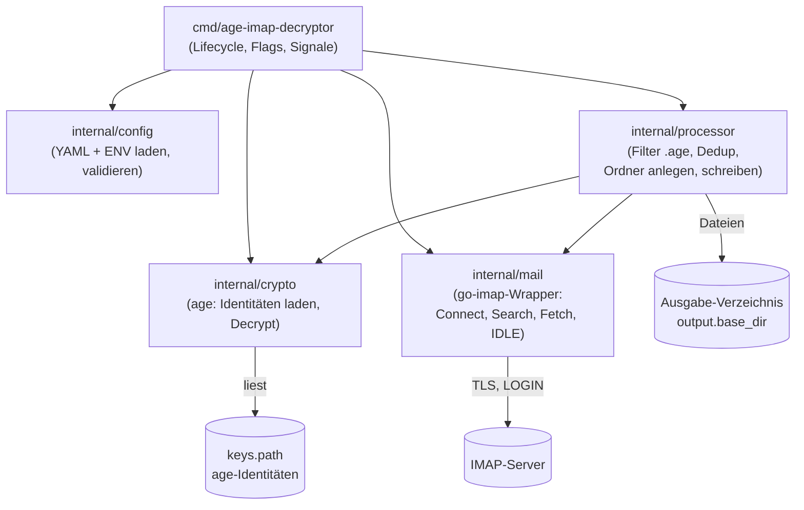
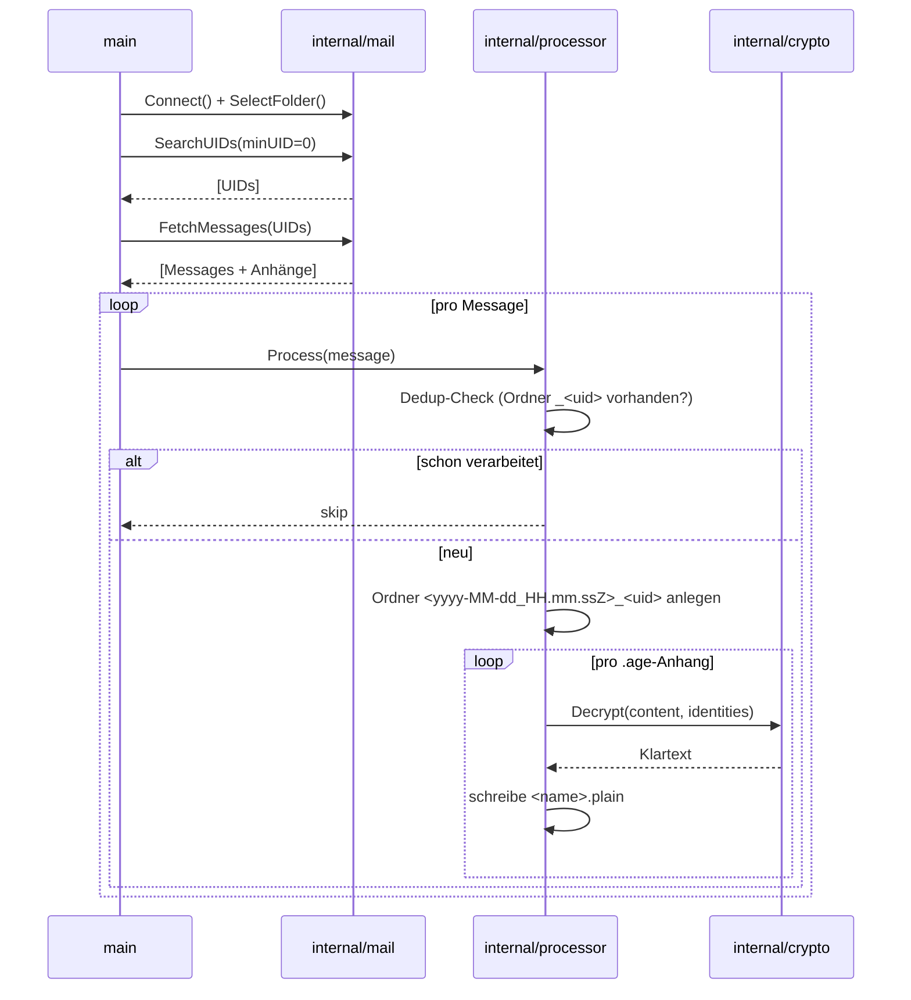
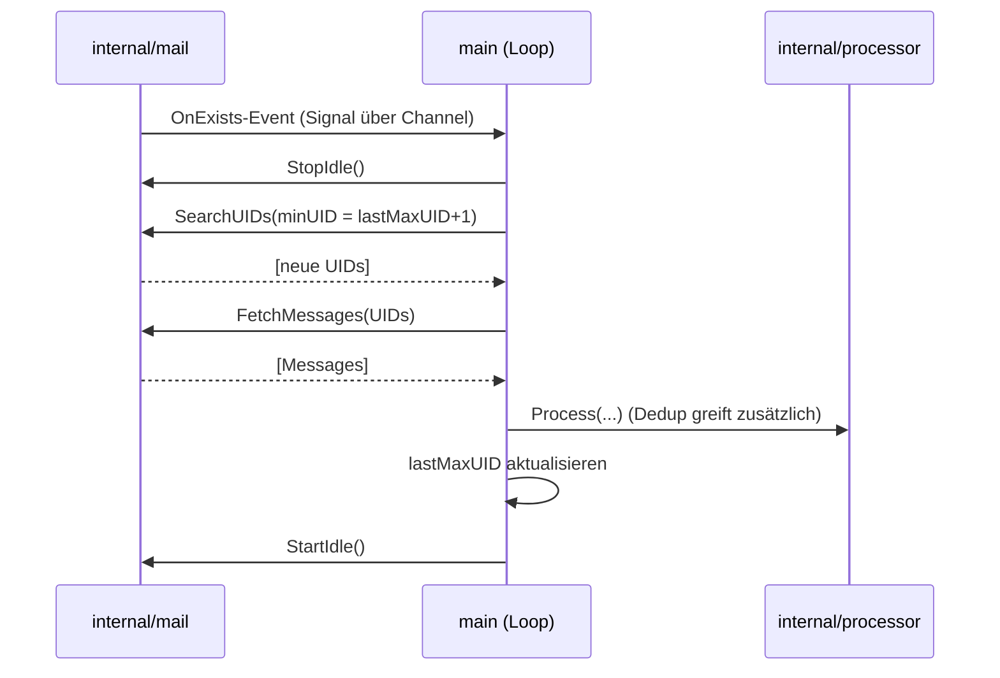

# Architektur — age-imap-decryptor

Dieses Dokument beschreibt den internen Aufbau des `age-imap-decryptor`:
einen Go-Dienst, der ein IMAP-Postfach überwacht, `.age`-verschlüsselte
Anhänge entschlüsselt und das Ergebnis lokal ablegt.

- Sprache: **Go ≥ 1.25** (Anforderung von `go-imap`)
- Quellcode- und Kommentarsprache: Englisch
- IMAP: [`github.com/BrianLeishman/go-imap`](https://github.com/BrianLeishman/go-imap)
- Krypto: [`filippo.io/age`](https://github.com/FiloSottile/age)
- Konfiguration: YAML + optionales ENV-Override fürs Passwort

---

## Überblick

Der Dienst hat genau eine Aufgabe: aus Mails eines konfigurierten Ordners die
Anhänge mit der Endung `.age` herausziehen, mit lokal hinterlegten
age-Identitäten entschlüsseln und pro Mail in einem eigenen Ausgabe-Ordner
speichern. Falls eine `*.meta.age.plain`-Sidecar-Datei vorhanden ist, wird die
zugehörige Payload-Datei anhand des darin enthaltenen `filename`-Felds
umbenannt. Er verändert das Postfach dabei **nicht** (kein Markieren, kein
Verschieben, kein Löschen).

Es gibt zwei unabhängig schaltbare Betriebsmodi:

- **Initial-Scan** — vorhandene Mails einmalig durchsuchen und verarbeiten.
- **IDLE** — per IMAP IDLE auf neu eingehende Mails warten und sofort verarbeiten.

Beide lassen sich kombinieren (Default: erst Scan, dann IDLE), einzeln nutzen
oder per CLI-Flag überschreiben.

---

## Komponenten



Verantwortlichkeiten je Paket:

- **`cmd/age-imap-decryptor`** — Einstiegspunkt. Liest Flags (`--config`,
  `--scan`, `--idle`), lädt Config, initialisiert Identitäten und Mail-Client,
  steuert den Lebenszyklus und behandelt `SIGINT`/`SIGTERM` für sauberes
  Herunterfahren.
- **`internal/config`** — Lädt die YAML-Datei, setzt Defaults
  (`port 993`, `mailbox INBOX`, `attachment_extension .age`), erlaubt ein
  Passwort-Override über `WATCHER_IMAP_PASSWORD` und validiert die Konfiguration
  (u. a. ungültiger Modus, wenn weder Scan noch IDLE aktiv ist).
- **`internal/crypto`** — Lädt beim Start alle age-Identitäten aus `keys.path`
  (`age.ParseIdentities` je Datei) und stellt eine `Decrypt`-Funktion bereit,
  die `age.Decrypt` mit allen Identitäten durchprobiert.
- **`internal/mail`** — Dünner Wrapper um `go-imap`. Kapselt Verbindung,
  Ordner-Auswahl, UID-Suche (mit optionalem `FROM`-Filter und UID-Untergrenze),
  das Laden vollständiger Mails inkl. Anhänge sowie Start/Stopp von IMAP IDLE.
  Reduziert die go-imap-Typen auf schlanke `Message`/`Attachment`-Structs.
- **`internal/processor`** — Orchestriert die eigentliche Verarbeitung: filtert
  Anhänge nach Endung, prüft auf bereits verarbeitete UIDs (Dedup), legt den
  Ausgabe-Ordner an, schreibt die entschlüsselten Dateien und benennt
  Payload-Dateien anhand von Sidecar-Metadaten um.

---

## Datenfluss

### Initial-Scan



### IDLE

Während IDLE aktiv ist, dürfen auf derselben Verbindung **keine** anderen
IMAP-Befehle laufen. Daher gilt: bei einem Event erst `StopIdle()`, dann
suchen/fetchen/verarbeiten, anschließend `StartIdle()` erneut.



`go-imap` erneuert IDLE intern (~alle 5 Min) und reconnectet bei Abbruch
inklusive Re-Auth und Wiederauswahl des Ordners. Für dauerhafte Fehler ist im
`main`-Loop ein zusätzliches Backoff vorgesehen.

---

## Zentrale Design-Entscheidungen

### Dedup ohne State-Datei (O1)
Der Ausgabe-Ordner heißt `<timestamp>_<message-uid>`. Da die UID das
identifizierende Merkmal ist, prüft der Processor vor der Verarbeitung, ob im
Ausgabe-Verzeichnis bereits ein Ordner mit dem Suffix `_<uid>` existiert. Falls
ja, wird die Mail übersprungen. Ein Neustart mit aktivem Initial-Scan
verarbeitet damit keine bereits entschlüsselten Mails erneut — ohne separate
Zustandsdatei.

### Abbruch bei Schreibfehlern (O2)
Lässt sich das Ausgabe-Verzeichnis nicht anlegen oder eine Datei nicht
schreiben, wird der Vorgang als Fatal-Fehler behandelt und der Dienst beendet
sich. Es wird nicht stillschweigend übersprungen.

### Dateibenennung (O4)
Alle entschlüsselten Anhänge einer Mail landen im selben
`<yyyy-MM-dd_HH.mm.ssZ>_<uid>`-Ordner. Der Klartext-Dateiname ist der **ursprüngliche**
Anhang-Name plus Suffix `.plain` (z. B. `report.pdf.age` → `report.pdf.age.plain`).

**Sidecar-Umbenennung:** Enthält der Ausgabe-Ordner nach dem Entschlüsseln
Paare aus `<prefix>.meta.age.plain` und `<prefix>.payload.age.plain`, liest
der Processor die Meta-Datei als JSON und benennt die Payload-Datei in den
darin angegebenen `filename`-Wert um:

```
attachment-001.meta.age.plain    {"filename":"screenshot-age-web.png","mime":"image/png",...}
attachment-001.payload.age.plain  →  screenshot-age-web.png
```

Sicherheitsregel: `filepath.Base` verhindert Directory-Traversal im
`filename`-Feld. Fehler beim Parsen oder eine fehlende Payload-Datei werden
stillschweigend übersprungen, damit das übrige Ergebnis erhalten bleibt.

### Postfach bleibt unangetastet (O5)
Stufe 1 ist gegenüber dem IMAP-Postfach rein lesend. Es werden keine Flags
gesetzt und keine Mails verschoben oder gelöscht.

### Passwort
Klartext-Passwort in der Config ist erlaubt. Empfohlen wird das Override per
`WATCHER_IMAP_PASSWORD` und das Schützen der Config-Datei (`chmod 600`), um
Klartext-Secrets in Images/Repos zu vermeiden.

---

## Konfiguration

> Erstelle eine example-Datei `config.example.yaml` und eine `config.yaml` die mit gitignore ignoriert wird. 
> Standard-Path wird ~/.age sein, dies muss auch unter Windows entsprechend aufgelöst werden.   

```yaml
imap:
  server: "imap.example.com"
  port: 993
  username: "user@example.com"
  password: "supersecret"        # optional via WATCHER_IMAP_PASSWORD überschreibbar
  mailbox: "INBOX"

filter:
  attachment_extension: ".age"
  sender: "absender@example.com" # optional; serverseitiger FROM-Filter

keys:
  path: "/etc/age-imap-decryptor/keys"

output:
  base_dir: "/var/lib/age-imap-decryptor/decrypted"

runtime:
  initial_scan: true
  idle: true
```

Modus-Matrix (`runtime` bzw. `--scan`/`--idle`):

| initial_scan | idle  | Verhalten |
|:---:|:---:|---|
| true  | true  | Scan, danach IDLE (Default) |
| true  | false | nur Scan, dann Ende |
| false | true  | nur IDLE |
| false | false | ungültig → Fehler beim Start |

---

## Lebenszyklus & Nebenläufigkeit

`main` baut einen `context.Context` auf, der bei `SIGINT`/`SIGTERM` abgebrochen
wird. Der IDLE-Handler läuft im Hintergrund (in `go-imap`) und meldet Events
über einen Channel an die `main`-Loop; die eigentliche IMAP-Interaktion
(Fetch/Search) findet ausschließlich in der Loop statt, niemals parallel zu
aktivem IDLE. Beim Herunterfahren wird IDLE gestoppt und die Verbindung
geschlossen.

---

## Externe Abhängigkeiten

| Abhängigkeit | Zweck | Hinweis |
|---|---|---|
| `github.com/BrianLeishman/go-imap` | IMAP-Client inkl. IDLE, Reconnect, Attachment-Parsing | benötigt Go 1.25+; intern `enmime` fürs MIME-Parsing |
| `filippo.io/age` | Entschlüsselung der `.age`-Anhänge | X25519-Identitäten (SSH/Passphrase nicht in Stufe 1) |
| `gopkg.in/yaml.v3` | Config-Parsing | — |

---

## CI/CD

- **`ci.yml`** — Build & Test auf Go 1.25: `go vet`, `go test -race ./...`,
  `go build ./...` (optional `golangci-lint`).
- **`docker.yml`** — Multi-Stage-Image bauen und nach **GHCR** publishen
  (`ghcr.io/<owner>/age-imap-decryptor`), getriggert auf `main` und Tags `v*`.

---

## Bewusst außerhalb von Stufe 1

Verschieben/Markieren verarbeiteter Mails, persistierte UID-Hochwassermarke,
Web-UI, Multi-Account, Health-/Metrics-Endpunkte sowie SSH- oder
Passphrase-basierte age-Empfänger. Diese Punkte sind Kandidaten für spätere
Stufen.